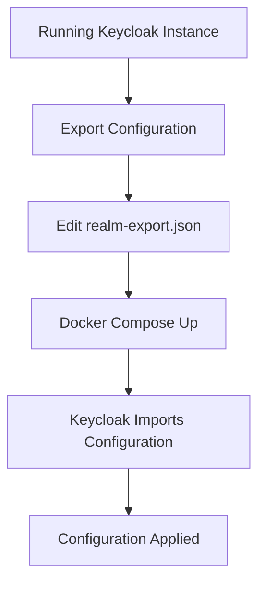

# Keycloak Configuration

## Overview

This directory contains the identity and access management configuration for the Hermes platform using Keycloak. These configurations define authentication flows, clients, roles, user federation, and security policies that govern how users authenticate and are authorized across our services.

## Directory Structure

```
keycloak/
├── README.md             # This documentation file
└── realm-export.json     # Complete realm configuration exported from Keycloak
```

## Key Configuration Details

The `realm-export.json` file includes:

- **Clients**: API services and web applications registered with Keycloak
- **Roles**: Predefined permissions for access control
- **Groups**: User groupings with assigned roles
- **Authentication Flows**: Login, registration, and MFA sequences
- **Identity Providers**: External authentication providers (if configured)
- **Client Scopes**: OAuth scopes defining access boundaries

## Configuration Flow



## How It Works

During Keycloak initialization, the container automatically imports configurations from this directory due to:

1. The volume mapping in `docker-compose.yml`:
   ```yaml
   volumes:
     - ./keycloak:/opt/keycloak/data/import
   ```
2. The `--import-realm` flag in the startup command

## Working with Configurations

### Viewing Current Configuration

The `realm-export.json` file should be the source of truth, kept in version control. If you need to understand the current setup, review this file or access the running Keycloak admin console.

### Making Configuration Changes

#### Approach 1: Direct Editing (Recommended for CI/CD)

For reproducible, version-controlled changes:

1. Make changes directly to `realm-export.json`
2. Commit changes to version control
3. Deploy with `docker compose down && docker compose up -d`

#### Approach 2: Admin Console (For Exploration and Testing)

For interactive changes that will later be committed:

1. Access the Keycloak admin interface at [http://localhost:8080](http://localhost:8080)
2. Login with admin credentials (`admin`/`admin123` by default)
3. Make necessary changes through the UI
4. Export the updated configuration (see below)
5. Commit the changes to version control

### Exporting Updated Configuration

After making changes in the admin console:

1. Go to the desired realm
2. Navigate to "Export" in the side menu
3. Enable "Export groups and roles" and "Export clients"
4. Click "Export" and save the JSON file
5. Review changes (using `git diff`) before replacing the existing `realm-export.json`

## Environment-Specific Configurations

For multi-environment setups (dev, staging, production):

- Use environment variables in `.env` files for environment-specific values
- Keep realm-export.json as generic as possible
- Consider using Keycloak's built-in environment override capabilities for sensitive values

## Troubleshooting

| Problem | Potential Solution |
|---------|-------------------|
| Import fails silently | Check Keycloak logs with `docker compose logs keycloak` |
| Realm not appearing | Verify JSON file is valid and properly formatted |
| Authentication issues | Check client configurations and test credentials |
| User federation not working | Verify LDAP/external provider settings and connectivity |

## Best Practices

- **Version Control**: Always commit configuration changes with descriptive messages
- **Peer Review**: Have team members review realm changes before applying to production
- **Backup**: Before major changes, create a backup using Keycloak's export feature
- **Security Review**: Regularly audit configurations, especially client access scopes
- **Documentation**: Document custom flows and client configurations within code comments
- **Minimal Permissions**: Follow principle of least privilege for all roles and groups

## Additional Resources

- [Official Keycloak Documentation](https://www.keycloak.org/documentation)
- [Keycloak Administration Guide](https://www.keycloak.org/docs/latest/server_admin/)
- [Keycloak Server Development](https://www.keycloak.org/docs/latest/server_development/)
- [Securing Applications with Keycloak](https://www.keycloak.org/docs/latest/securing_apps/)
- [API Documentation](https://www.keycloak.org/docs-api/latest/rest-api/)
